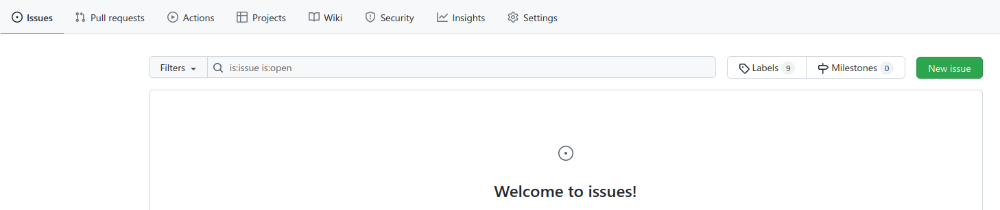
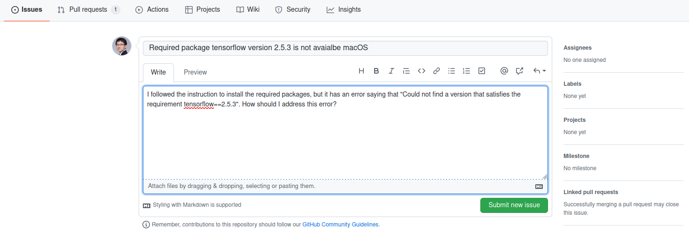
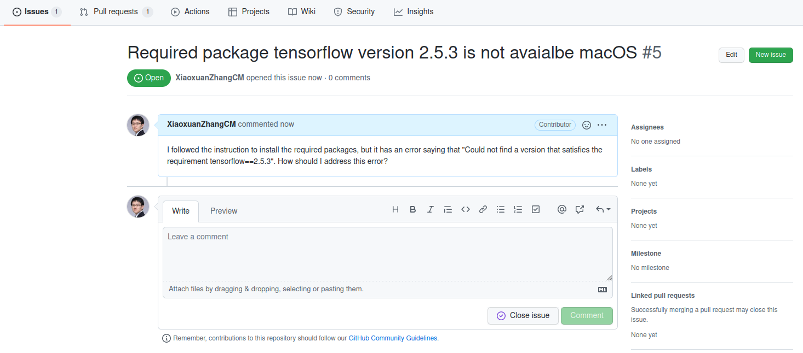
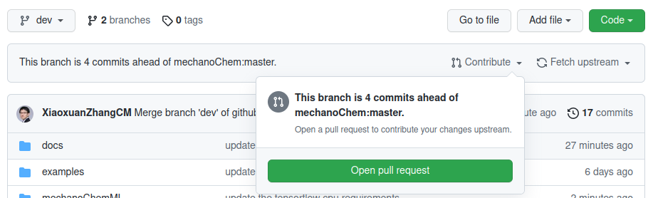
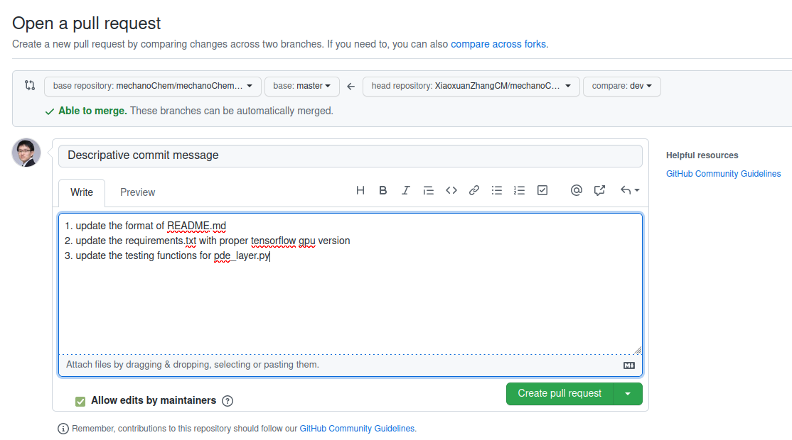

************
Contributing
************

Thanks for considering contributing to this project!

Bug report
==========

We use Github issues to keep track of bugs. Please report bugs by starting a new issue with detailed information of your system and code environment. One can follow these three steps. (Click on the images to enlarge.)

Step 1: create a new issue

Step 2: add detailed information about the issue

Step 3: submit and track the issue. Leave additional comments if needed.

Code contribution
=================

You can submit a pull request to contribute new code either to fix a bug, to add a new class/function, to add a new example, or to add a new workflow. Follow these steps to contribute.

Step 1: login to your GitHub account and "fork" the project 

Step 2: clone the forked "mechanochemML" project to your local system

Step 3: make a new branch by "git branch -b your_branch_name"

Step 4: make changes

Step 5: push changes back to your repo

Step 6: from your GitHub account, choose the "mechanochemML" repo. Click the "Compare & pull request" button. If you don't see this button, you can click "Contribute" and then click "Open pull request". (You have to do so under the branch where you made the changes)

Step 7: add the commit message with detailed descriptions, and "Create pull request"

Step 8: you can track the pull requests 

.. figure:: figures/contribute-3.png
   :scale: 45 %
   :align: center

Workflow contribution
=====================

You are welcome to contribute new workflows to this library. The steps to contribute a workflow are the same as these discussed in `Code contribution`_. However, it is very beneficial if one can provide a complete set of the following components to make the workflow more approachable:

- re-usable classes/functions to ``mechanoChemML/mechanoChemML/src``
- workflow specific code to ``mechanoChemML/mechanoChemML/workflows/new_workflow_name``
- workflow description to ``mechanoChemML/docs/new_workflow_name.rst``
- workflow example to ``mechanoChemML/examples/new_workflow_name/new_example_name``
- workflow example data to ``mechanoChemML/examples/new_workflow_name/new_example_name/data``
- workflow example description to ``mechanoChemML/docs/new_workflow_name.rst``
- ideally, some testing functions to ``mechanoChemML/mechanoChemML/testing``

Other contribution
==================

Contributions related to improving the documentations or writing testing functions are also welcomed. Please follow these steps in `Code contribution`_.
