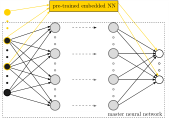
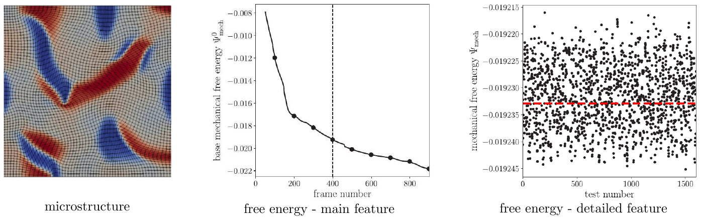
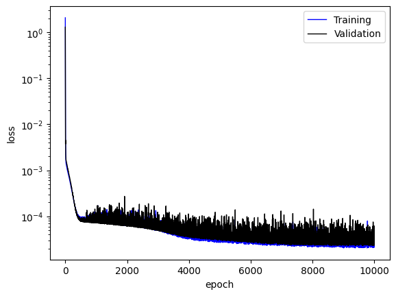
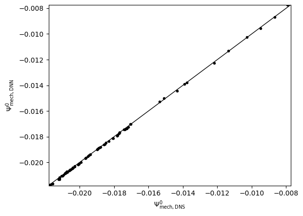
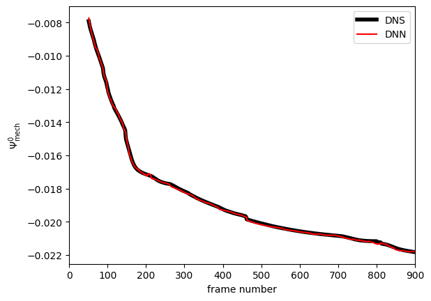

:orphan:

*************************
Multi-resolution learning
*************************

   Illustration of the NN architecture used for the multi-resolution learning workflow.

Description
===========
In materials physics problems, it is not uncommon to encounter data that possesses a hierarchical structure. Multi-resolution learning can be used to capture the details in the data, which were not well-delineated by the pre-trained model for the dominant characteristics of data.

Example: Learn the free energy and nonlinear elastic response of evolving microstructures
=========================================================================================

   Illustration of the hierarchical data structure (with main feature and detailed feature) for the free energy of microstructures.

When studying the homogenized stress-strain response of a family of multi-component crystalline microstructures, the free energy of each microstructure has a multi-resolution structure with a dominant trajectory from phase transformations that drive evolution of the microstructure, and small-scale fluctuations from strains that explore the effective elastic response of a given microstructure. The dominant trajectory strongly depends on the microstructural information, such as the volume fraction, the location and orientation of each crystalline phase, and the interfaces, whereas the small-scale fluctuations are related to the applied loading. 

Example 1: Learn single microstructure with dnn
-----------------------------------------------

In this example, DNNs are used to learn both the main feature and the detailed feature in the dataset. Users can refer to [1] for the discussion of selecting features for DNNs.

Data preparation
^^^^^^^^^^^^^^^^
The required physics-based direct numerical simulation data is generated with the `mechanoChemIGA <https://github.com/mechanoChem/mechanoChemIGA>`_ library and has been preprocessed and stored at

.. code-block:: text

    examples/mr_learning/Example1_single_microstructure_dnn/data

Step 1: Hyper-parameter search for DNNs to learn the main feature of data
^^^^^^^^^^^^^^^^^^^^^^^^^^^^^^^^^^^^^^^^^^^^^^^^^^^^^^^^^^^^^^^^^^^^^^^^^

Configuration file
""""""""""""""""""

Input parameters are defined in the .ini configuration file. The data file location is given by

.. literalinclude:: ../examples/mr_learning/Example1_single_microstructure_dnn/step1_hp_search_main/dnn-free-energy-1dns.ini
   :lines: 5

All the fields used for the features and labels are given by

.. literalinclude:: ../examples/mr_learning/Example1_single_microstructure_dnn/step1_hp_search_main/dnn-free-energy-1dns.ini
   :lines: 6

which represent the mechanical free energy (main feature), volume fraction of positive rectangular phase, volume fraction of negative rectangular phase, interfacial length between the square phase and the rectangle phases, interfacial length of the positive rectangle phase, and interfacial length of the negative rectangle phase.

The fields for labels are specified by 

.. literalinclude:: ../examples/mr_learning/Example1_single_microstructure_dnn/step1_hp_search_main/dnn-free-energy-1dns.ini
   :lines: 7

The hyperparameter search space is defined by

.. literalinclude:: ../examples/mr_learning/Example1_single_microstructure_dnn/step1_hp_search_main/dnn-free-energy-1dns.ini
   :lines: 66-70

where the hidden layer can range from 1 to 10 with an increment of 1. The node on each layer could range from 2 to 256, which will be a multiple of 2. The learning rate would be a discrete value out of  0.1, 0.01, and 0.001. 

How to run the simulation
"""""""""""""""""""""""""

.. code-block:: bash

    cd examples/mr_learning/Example1_single_microstructure_dnn/step1_hp_search_main
    python hyper_parameter_search.py

Results
"""""""

During the hyper-parameter search, different NNs are ranked based on their averaged final loss, with output results like

.. code-block:: bash

    current best model with least val_loss:
    index 	 train_loss 		 val_loss
    77 	 7.414259016513824e-05 	 5.881459583179094e-05
    87 	 7.532430026913062e-05 	 5.9009002870880065e-05
    83 	 8.772087603574619e-05 	 5.908306338824332e-05
    ...
    43 	 6.441665755119175e-05 	 6.0430567100411284e-05
    65 	 7.197074592113495e-05 	 6.062381216906942e-05
    73 	 7.458794716512785e-05 	 6.076862700865604e-05
    21 	 6.604821974178776e-05 	 6.0818938072770835e-05

The output indicates that model 77 is the best one, even though others are equally good as their train loss and validation loss are very small as well. After the ranked loss, one can find the model index and model architecture information, e.g, 

.. code-block:: bash

    index0:  77 [1, 76, 533]
    model:  77  has been trained, move to next model!

Here, 77 is the model index, 1 is the total hidden layer number, 76 is the neuron number per layer, 533 is total parameters in this model.

Step 2: Train the optimal DNN to learn the main feature of data
^^^^^^^^^^^^^^^^^^^^^^^^^^^^^^^^^^^^^^^^^^^^^^^^^^^^^^^^^^^^^^^

Configuration file
""""""""""""""""""

One needs to modify the file `dnn-free-energy-1dns-final.ini`

.. code-block:: bash

    cd examples/mr_learning/Example1_single_microstructure_dnn/step2_final_dnn_main
    vi dnn-free-energy-1dns-final.ini

and provide the best NN architecture obtained from step 1 (77 [1, 76, 533]) to the following variable in the input file

.. code-block:: bash

    [MODEL]
    NodesList = 76
    Activation = softplus

Here, :code:`76` indicates that a DNN contains one densely connected layer with 76 neuron on it and a :code:`softplus` activation function.

How to run the simulation
"""""""""""""""""""""""""

Once the input file is modified, one can run the following to train the NN.

.. code-block:: bash

    cd examples/mr_learning/Example1_single_microstructure_dnn/step2_final_dnn_main
    python dnn_1dns_final.py

At the end of the training, the final weights of the NN will be saved as 

.. code-block:: bash

    saved_weight/cp-10000.ckpt 

Results
"""""""

The training log and NN prediction are saved in the output pickle files. To plot the results, one needs to run

.. code-block:: bash

    python plot_data_and_history.py all_data_{timestamp}.pickle

Please replace the "{timestamp}" with the actual timestamp info from the output. We will get the training loss and NN results for the main feature and detailed feature of data.

   Training loss

   NN predicted main feature

   NN learned and predicted main feature 

Step 3: Hyper-parameter search for MRNNs to learn the detail feature of data
^^^^^^^^^^^^^^^^^^^^^^^^^^^^^^^^^^^^^^^^^^^^^^^^^^^^^^^^^^^^^^^^^^^^^^^^^^^^

Configuration file
""""""""""""""""""

One needs to modify the file `kbnn-load-dnn-1-frame-hyperparameter-search.ini` by providing the information of the NN that learned the main feature of the data by

.. code-block:: bash

    cd examples/mr_learning/Example1_single_microstructure_dnn/step3_hp_search_mrnn_detail
    vi kbnn-load-dnn-1-frame-hyperparameter-search.ini

The information at the section :code:`[KBNN]` should be updated, such as

.. code-block:: bash

    [KBNN]
    LabelShiftingModels = ../step2_final_dnn_main/dnn-free-energy-1dns-final.ini
    OldShiftFeatures = vol_rectangle_p, vol_rectangle_m,len_c,len_s_r_p,len_s_r_m
    OldShiftMean = 0.195798, 0.195384, 0.074566, 0.051366,0.055325
    OldShiftStd = 0.014416, 0.017324, 0.033848, 0.014693, 0.016482
    OldShiftLabelScale = 100
    OldShiftDataNormOption = 3

How to run the simulation
"""""""""""""""""""""""""

One the input file is prepared, one can run the following to perform the hyper-parameter search for the multi-resolution NN to learn the detailed feature.

.. code-block:: bash

    cd examples/mr_learning/Example1_single_microstructure_dnn/step3_hp_search_mrnn_detail
    python hyper_parameter_search.py

Results
"""""""

Again, different NNs are ranked based on their averaged final loss. See discussion from Step 1. 

Step 4: Train the optimal MRNN to learn the detail feature of data
^^^^^^^^^^^^^^^^^^^^^^^^^^^^^^^^^^^^^^^^^^^^^^^^^^^^^^^^^^^^^^^^^^

Configuration file
""""""""""""""""""

One needs to modify the file `kbnn-load-dnn-1-frame.ini`

.. code-block:: bash

    cd examples/mr_learning/Example1_single_microstructure_dnn/step4_final_mrnn_no_penalize_P
    vi kbnn-load-dnn-1-frame.ini

and provide the best NN architecture obtained from step 3 to the following variable in the input file

.. code-block:: bash

    [MODEL]
    NodesList = 26, 26
    Activation = softplus, softplus

Here, :code:`26,26` indicates that a DNN contains two densely connected layers with 76 neuron on each and the :code:`softplus` activation function for each layer.

How to run the simulation
"""""""""""""""""""""""""

Once the input file is modified, one can run the following to train the NN.

.. code-block:: bash

    cd examples/mr_learning/Example1_single_microstructure_dnn/step4_final_mrnn_no_penalize_P
    python kbnn_1_frame_dnn.py

Results
"""""""

References
==========

[1]. X Zhang, K Garikipati. "Machine learning materials physics: Multi-resolution neural networks learn the free energy and nonlinear elastic response of evolving microstructures", Computer Methods in Applied Mechanics and Engineering, 372, 113362, 2020, `doi:10.1016/j.cma.2020.113362 <https://doi.org/10.1016/j.cma.2020.113362>`_, preprint at `arXiv:2001.01575 <https://arxiv.org/abs/2001.01575>`_.
