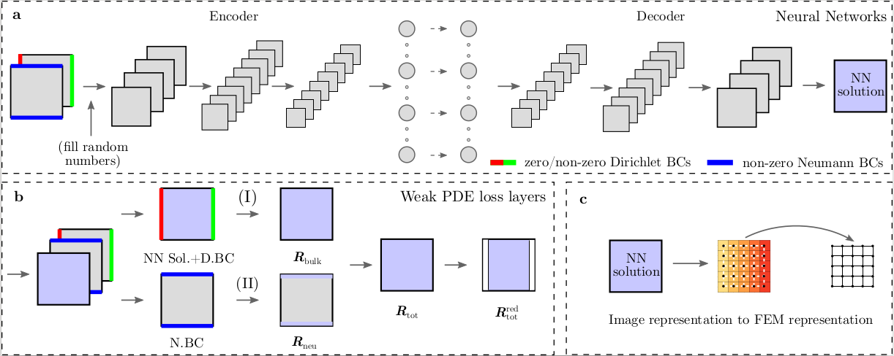
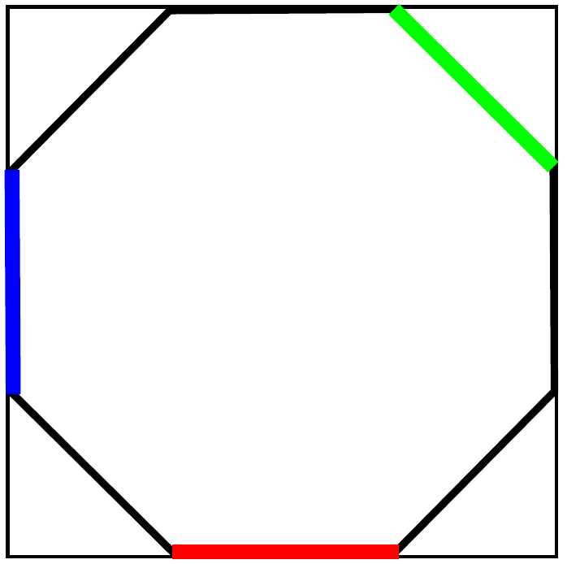

:orphan:

*******************
NN-based PDE solver
*******************

   Illustration of the NN-based PDE solver workflow.

Description
===========

The high-throughput solution of PDEs for inverse modelling, design and optimization leads to requirements of very fast solutions that are largely beyond the capability of traditional PDE solver libraries.The NN-based PDE solver workflow is developed for such purpose, which could predict the full field solutions orders faster than the traditional PDE solvers. Such solver works for both small dataset, which only contains a few of BVPs, and large dataset, which could contain hundreds of thousands BVPs.

Examples
========

Example 1: Steady state diffusion on an octagon domain with mixed BCs
---------------------------------------------------------------------
Here, we use the proposed PDE constrained NNs to solve steady-state diffusion on an octagonal domain with mixed BCs, as shown in the following figure, whose solution is nonlinear in both X- and Y- directions.

   Illustration of the setup of the BVP (red: zero Dirichlet BC, green: non-zero Dirichlet BC, blue: non-zero Neumann BC).

Data preparation
^^^^^^^^^^^^^^^^

Since the NN-based PDE solver only takes BCs information as inputs, the training data can be generated with any software, as long as the format is consistent as discussed in [1]. The required data for this example is provided at

.. code-block:: bash

    cd examples/pde_solver/Example1_diffusion_steady_state/data

How to run the example
^^^^^^^^^^^^^^^^^^^^^^

The following commands will run the deterministic NN-based PDE solver

.. code-block:: bash

    cd examples/pde_solver/Example1_diffusion_steady_state/
    python main.py octagon-32x32-cnn.ini

The simulation results will be saved in the `results/` folder. The checkpoints are saved in the `restart/` folder. To run the Bayesian NN example with a warm start as discussed in [1], one need to provide the training summary `pickle` file from `results/` to `octagon-32x32-bnn.ini` at

.. code-block:: bash

    [NN]
    SaveCNNModel = results/auto_generated_deterministic_model_summary.pickle

Following that step, one can run the probabilistic NN-based PDE solver via

.. code-block:: bash

    cd examples/pde_solver/Example1_diffusion_steady_state/
    python main.py octagon-32x32-bnn.ini

Note: tensorflow and tensorflow-probability libraries installed by the requirements.txt are CPU-based distributions. If you have a CUDA-enabled machine, you can also install the GPU versions of these two libraries to speedup the training. In general, tensorflow version needs to be greater than 2.2. The version of tensorflow-probability needs to be compatible with the version of tensorflow.

References
==========

[1]. X Zhang, K Garikipati. "Bayesian neural networks for weak solution of PDEs with uncertainty quantification", preprint at `arXiv:2101.04879 <https://arxiv.org/abs/2101.04879>`_.
