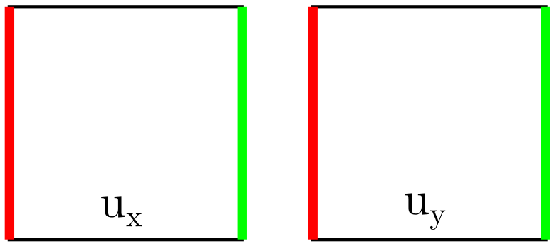
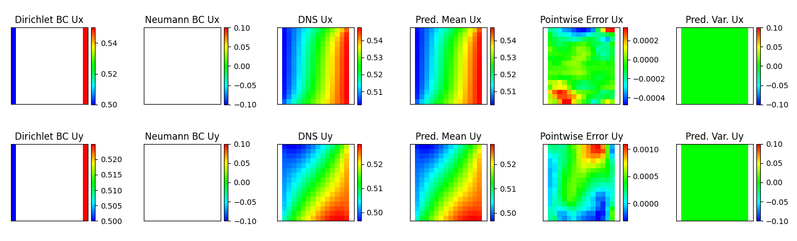
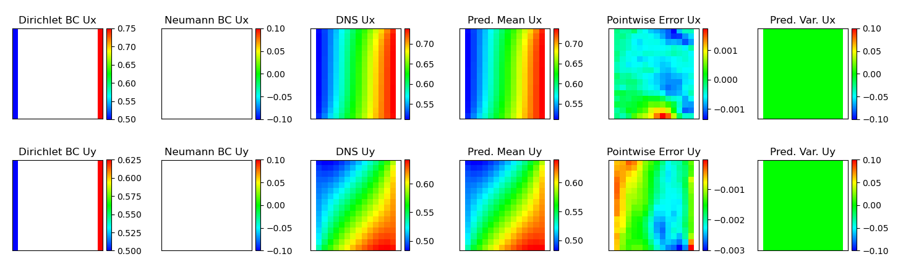

:orphan:

*******************
NN-based PDE solver
*******************

.. figure:: figures/NN-based-pde-solver.png
   :scale: 50 %
   :align: center

   Illustration of the NN-based PDE solver workflow.

Description
===========

The high-throughput solution of PDEs for inverse modelling, design and optimization leads to requirements of very fast solutions that are largely beyond the capability of traditional PDE solver libraries.The NN-based PDE solver workflow is developed for such purpose, which could predict the full field solutions orders faster than the traditional PDE solvers. Such solver works for both small dataset, which only contains a few of BVPs, and large dataset, which could contain hundreds of thousands BVPs.

Examples
========

Example 1: Steady state diffusion on an octagon domain with mixed BCs
---------------------------------------------------------------------

Simulation setup
^^^^^^^^^^^^^^^^
Here, we use the proposed PDE constrained NNs to solve steady-state diffusion on an octagonal domain with mixed BCs, as shown in the following figure, whose solution is nonlinear in both X- and Y- directions.

.. figure:: figures/nn-based-pde-sovler-octagon-example.png
   :scale: 20 %
   :align: center

   Illustration of the setup of the BVP (red: zero Dirichlet BC, green: non-zero Dirichlet BC, blue: non-zero Neumann BC).

Data preparation
^^^^^^^^^^^^^^^^

Since the NN-based PDE solver only takes BCs information as inputs, the training data can be generated with any software, as long as the format is consistent as discussed in [1]. The required data for this example is provided at

.. code-block:: bash

    ls examples/pde_solver/Example1_diffusion_steady_state/data

Configuration file
^^^^^^^^^^^^^^^^^^

Input parameters are defined in the .ini configuration file. For deterministic NNs, the data location is given by  

.. literalinclude:: ../examples/pde_solver/Example1_diffusion_steady_state/octagon-32x32-cnn.ini 
   :lines: 1-3

For small dataset, it will be augmented by 2^# times with # given at   

.. literalinclude:: ../examples/pde_solver/Example1_diffusion_steady_state/octagon-32x32-cnn.ini 
   :lines: 4

The training information is given at 

.. literalinclude:: ../examples/pde_solver/Example1_diffusion_steady_state/octagon-32x32-cnn.ini 
   :lines: 5-9

where InitialEpoch refers to the zero initialization in [1].

The NN architecture is given at 

.. literalinclude:: ../examples/pde_solver/Example1_diffusion_steady_state/octagon-32x32-cnn.ini 
   :lines: 10-29

which includes a list of Conv2D, MaxPooling2D, Dense, UpSampling2D layers. The PDERandom layer refers to the process where we fill random numbers to the interior region of a domain in the Dirichlet channel of augmented dataset to ensure each input is independent from each other.

For Bayesian NNs (BNN), similar as for the deterministic NNs, the data location is given by  

.. literalinclude:: ../examples/pde_solver/Example1_diffusion_steady_state/octagon-32x32-bnn.ini 
   :lines: 1-3

For small dataset, it will be augmented by 2^# times with # given at   

.. literalinclude:: ../examples/pde_solver/Example1_diffusion_steady_state/octagon-32x32-bnn.ini 
   :lines: 4

The training information is given at 

.. literalinclude:: ../examples/pde_solver/Example1_diffusion_steady_state/octagon-32x32-bnn.ini 
   :lines: 5-12

where InitialEpoch refers to the zero initialization in [1]. Note, if we train the BNNs with cold start, the zero initialization will play a role. If the BNNs are trained with warm start, zero initialization process will be skipped. Sigma1 is the additive noise applied to the solution. The initial value of Sigma2 is provided, which will evolve during the training.

For warm start, one needs to provide the training log file (saved as a .pickle file in the results/) to the following line.

.. literalinclude:: ../examples/pde_solver/Example1_diffusion_steady_state/octagon-32x32-bnn.ini 
   :lines: 13

The NN architecture is given at 

.. literalinclude:: ../examples/pde_solver/Example1_diffusion_steady_state/octagon-32x32-bnn.ini 
   :lines: 14-33

which includes a list of Convolution2DFlipout, MaxPooling2D, DenseFlipout, UpSampling2D layers. Again, the PDERandom layer refers to the process where we fill random numbers to the interior region of a domain in the Dirichlet channel of augmented dataset to ensure each input is independent from each other.

How to run the example
^^^^^^^^^^^^^^^^^^^^^^

The following commands will run the deterministic NN-based PDE solver

.. code-block:: bash

    cd examples/pde_solver/Example1_diffusion_steady_state/
    python main.py octagon-32x32-cnn.ini

The simulation results will be saved in the `results/` folder. The checkpoints are saved in the `restart/` folder. 

To run the Bayesian NN example with a `warm start` as discussed in [1], one need to provide the training summary `pickle` file from `results/` to `octagon-32x32-bnn.ini`. The training summary file can be found from

.. code-block:: bash

   ls results/\*.pickle

One need to edit `octagon-32x32-bnn.ini`

.. code-block:: bash

   vi octagon-32x32-bnn.ini

and provide the `pickle` to the variable `SaveCNNModel` in the input file

.. code-block:: bash

    [NN]
    SaveCNNModel = results/{auto_generated_deterministic_model_summary}.pickle

Please replace `{auto_generated_deterministic_model_summary}` with the actual name of the `pickle` file.

Following that step, one can run the probabilistic NN-based PDE solver via

.. code-block:: bash

    python main.py octagon-32x32-bnn.ini

Results
^^^^^^^

At the end of training, the NN-based PDE solver will output training loss and NN predicted results for one testing data point in the "results/" folder.

.. figure:: figures/nn-based-pde-solver-example1-result-1.png
   :scale: 30 %
   :align: center

   Results: 1. Dirichlet BC, 2. Neumann BC in x direction, 3. Neumann BC in y direction, 4. DNS solution, 5. NN predicted results (determnistic) or mean of NN predicted results (Bayesian) with the same color legend as 4, 6. Pointwise error between 4 and 5, 7. similar as 5 but with a color legend representing the actual predicted solution range. 

Example 2: Linear elasticity on a square domain with Dirichlet BCs
------------------------------------------------------------------

Simulation setup
^^^^^^^^^^^^^^^^
Here, we use the proposed PDE constrained NNs to solve linear elasticity on a square domain with Dirichlet BCs, as shown in the following figure, whose solution is nonlinear in both X- and Y- directions.

   Illustration of the setup of the BVP (red: zero Dirichlet BC, green: non-zero Dirichlet BC).

Data preparation
^^^^^^^^^^^^^^^^

Since the NN-based PDE solver only takes BCs information as inputs, the training data can be generated with any software, as long as the format is consistent as discussed in [1]. The required data for this example is provided at

.. code-block:: bash

    ls examples/pde_solver/Example2_linear_elasticity/data

Configuration file
^^^^^^^^^^^^^^^^^^

Similar as example 1

How to run the example
^^^^^^^^^^^^^^^^^^^^^^

Similar as example 1

Results
^^^^^^^

At the end of training, the NN-based PDE solver will output training loss and NN predicted results for one testing data point in the "results/" folder.

   Results: 1. Dirichlet BC, 2. Neumann BC, 3. DNS solution, 4. NN predicted results (determnistic) or mean of NN predicted results (Bayesian) with the same color legend as 3, 5. Pointwise error between 3 and 4, 6. Predicted variance for Bayesian NNs (zero for deterministic NNs). 

Example 3: Non-linear elasticity on a square domain with Dirichlet BCs
----------------------------------------------------------------------

Simulation setup
^^^^^^^^^^^^^^^^
Here, we use the proposed PDE constrained NNs to solve nonlinear elasticity on a square domain with Dirichlet BCs, as shown in the following figure, whose solution is nonlinear in both X- and Y- directions.

   Illustration of the setup of the BVP (red: zero Dirichlet BC, green: non-zero Dirichlet BC).

Data preparation
^^^^^^^^^^^^^^^^

Since the NN-based PDE solver only takes BCs information as inputs, the training data can be generated with any software, as long as the format is consistent as discussed in [1]. The required data for this example is provided at

.. code-block:: bash

    ls examples/pde_solver/Example3_nonlinear_elasticity/data

Configuration file
^^^^^^^^^^^^^^^^^^

Similar as example 1

How to run the example
^^^^^^^^^^^^^^^^^^^^^^

Similar as example 1

Results
^^^^^^^

At the end of training, the NN-based PDE solver will output training loss and NN predicted results for one testing data point in the "results/" folder.

   Results: 1. Dirichlet BC, 2. Neumann BC, 3. DNS solution, 4. NN predicted results (determnistic) or mean of NN predicted results (Bayesian) with the same color legend as 3, 5. Pointwise error between 3 and 4, 6. Predicted variance for Bayesian NNs (zero for deterministic NNs). 

Remarks
=======

Command line
------------

How to restart simulation from a specific check point (e.g. epoch 5000) and make predictions

.. code-block:: bash

    cd examples/pde_solver/Example1_diffusion_steady_state/
    python main.py octagon-32x32-cnn.ini -rf results/{auto_generated_model_summary}.pickle -ra 5000

If the option "-ra" is not provided, the simulation will restart from the latest check point.

How to restart simulation from a specific check point and continue running the problem for another 1000 epochs

.. code-block:: bash

    cd examples/pde_solver/Example1_diffusion_steady_state/
    python main.py octagon-32x32-cnn.ini -rf results/{auto_generated_model_summary}.pickle -c 1000

Note
----

Tensorflow and tensorflow-probability libraries installed by the requirements.txt are CPU-based distributions. If you have a CUDA-enabled machine, you can also install the GPU versions of these two libraries to speedup the training. In general, tensorflow version needs to be greater than 2.2. The version of tensorflow-probability needs to be compatible with the version of tensorflow. This is automatically handled by the provided installation instructions.

References
==========

[1]. X Zhang, K Garikipati. "Bayesian neural networks for weak solution of PDEs with uncertainty quantification", preprint at `arXiv:2101.04879 <https://arxiv.org/abs/2101.04879>`_.
