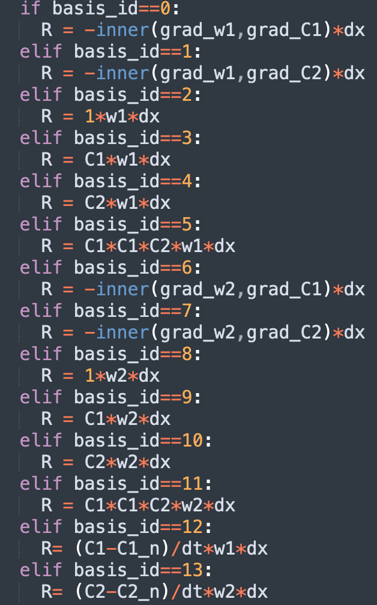
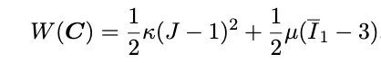
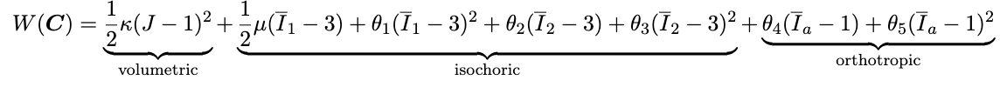
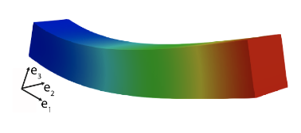

:orphan:

*********************
System identification
*********************

.. figure:: figures/systemID_flowchart_doc.png
   :scale: 25 %
   :align: center

   Schematic of the Variational System Identification.
	 
Description
===========
Inference of PDEs from data-inverse modelling of not just parameters but of the entire set of algebraic and differential operators is feasible with the availability of extensive data, regression, and more generally, nonlinear optimization methods. Along with the development of neural network PDE solvers, system inference enjoys advantages when the variational setting of the weak form, as well as discretization structures such as finite elements and finite differences are exploited. The system identification workflow uses a class of inverse modeling techniques that allows physics discovery from data. 

Examples
========

Example 1: Pattern formation
----------------------------
The example used here is identifying the governing equation of Turing pattern physics:

.. figure:: figures/systemID_equations.png
   :scale: 70 %
   :align: center

For an activator-inhibitor species pair, these equations use auto-inhibition with cross-activation of a short range species, and auto-activation with cross-inhibition of a long range species to form so-called Turing patterns:

.. figure:: figures/Schnakenberg_C1.png
   :scale: 20 %
   :align: center

   Example of the composition simulated using the Schnakenberg kinetics model.

Data preparation
^^^^^^^^^^^^^^^^
The data are generated by the coupled diffusion-reaction equations for two species following Schnakenberg kinetics. The Schnakenberg kinetics model was pre-built within this workflow, and can be called using the Schnakenberg_model interface (required FEniCS enabled):

.. literalinclude:: ../examples/systemID/Example1_pattern_forming/main.py 
   :lines: 20-21

The bases (operators) can be constructed afterward (required FEniCS enabled):

.. literalinclude:: ../examples/systemID/Example1_pattern_forming/main.py 
   :lines: 26-27

Note the bases are also pre-calculated and save in the datasets, therefore in this example the data can be directly loaded from the data set. By defaults we constructed 14 operators with the following labeling:

Configuration file
^^^^^^^^^^^^^^^^^^
Standard parameters in the workflow can be defined in the .ini configuration file. It usually contains two part: VSI and Stepwise regression. In VSI part, the identifying strategy and target operator index can be defined:

.. literalinclude:: ../examples/systemID/Example1_pattern_forming/config_Example1.ini
   :lines: 5-10

In Stepwise regression part, we can define the settings to perform stepwise regression. If some parameters are not defined, the default values will be applied.

.. literalinclude:: ../examples/systemID/Example1_pattern_forming/config_Example1.ini
   :lines: 12-19

How to run the example

The following commands will run the problem with the configuration file.

.. code-block:: bash

    cd examples/systemID/Example1_pattern_forming/
    python main.py config_Example1.ini

	 
Results

Note in this example we choose the operator #12 (the time derivative of C1) as the target operator, therefore, we will identify the frist equations. The final result is one array with non-zero prefactors for active operators and zero prefactors for non-active operators. From the following array we can identify that operators #0, #2, #3 and #5 are active with prefactors 0.05, 0.1, -1 and 1.

.. code-block:: bash

      Final result: [ 0.05  0.    0.1  -1.    0.    1.    0.    0.    0.    0.    0.    0.  0.  ]

Example 2: Inference of deformation mechanisms and constitutive response of soft material
The example used here is to infer the physically best-suited and parsimonious mathematical models of the soft material mechanical response. A commonly used constitutive model for isotropic and nearly incompressible soft biological tissue and polymers is the neo-Hookean strain energy density function:

This example considers a number of deformation mechanisms as possible candidates in the strain energy density function. 

In this example we aim to identify the strain energy density function with the full field synthetic data from forward computations on rectangular prismatic blocks:

Configuration file
^^^^^^^^^^^^^^^^^^
Standard parameters in the workflow can be defined in the .ini configuration file. Again, in VSI part, the identifying strategy and target operator index can be defined:

.. literalinclude:: ../examples/systemID/Example2_soft_materials/config_Example2.ini
   :lines: 5-10

In Stepwise regression part, we can define the settings to perform stepwise regression.

.. literalinclude:: ../examples/systemID/Example2_soft_materials/config_Example2.ini
   :lines: 12-19

How to run the example

The following commands will run the problem with the configuration file.

.. code-block:: bash

    cd examples/systemID/Example2_soft_materials/
    python main.py config_Example2.ini

Results

From the following array we can identify the bulk and shear moduli with correct values.

.. code-block:: bash

      Final result: [ 40.  -0.  -0.  -0.  -0.  -0. 400.  -0.]

References
==========

Z. Wang, X. Huan, K. Garikipati. "Variational system identification of the partial differential equations governing microstructure evolution in materials: Inference over sparse and spatially unrelated data", Computer Methods in Applied Mechanics and Engineering Vol 377, 113706, 2021, doi.org/10.1016/j.cma.2021.113706.

Z. Wang, J.B. Estrada, E.M. Arruda, K. Garikipati. "Discovery of deformation mechanisms and constitutive response of soft material surrogates of biological tissue by full-field characterization and data-driven variational system identification", Journal of the Mechanics and Physics of Solids Vol. 153, 104474, 2021
