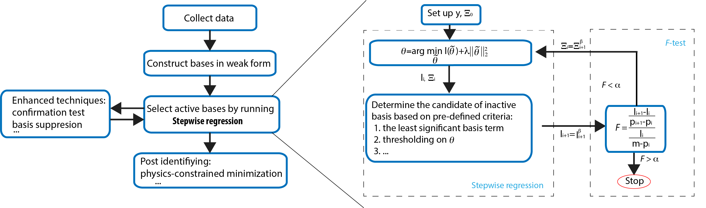
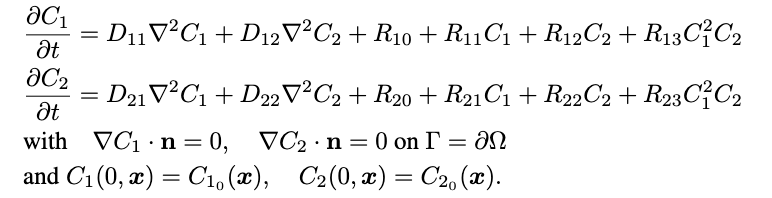
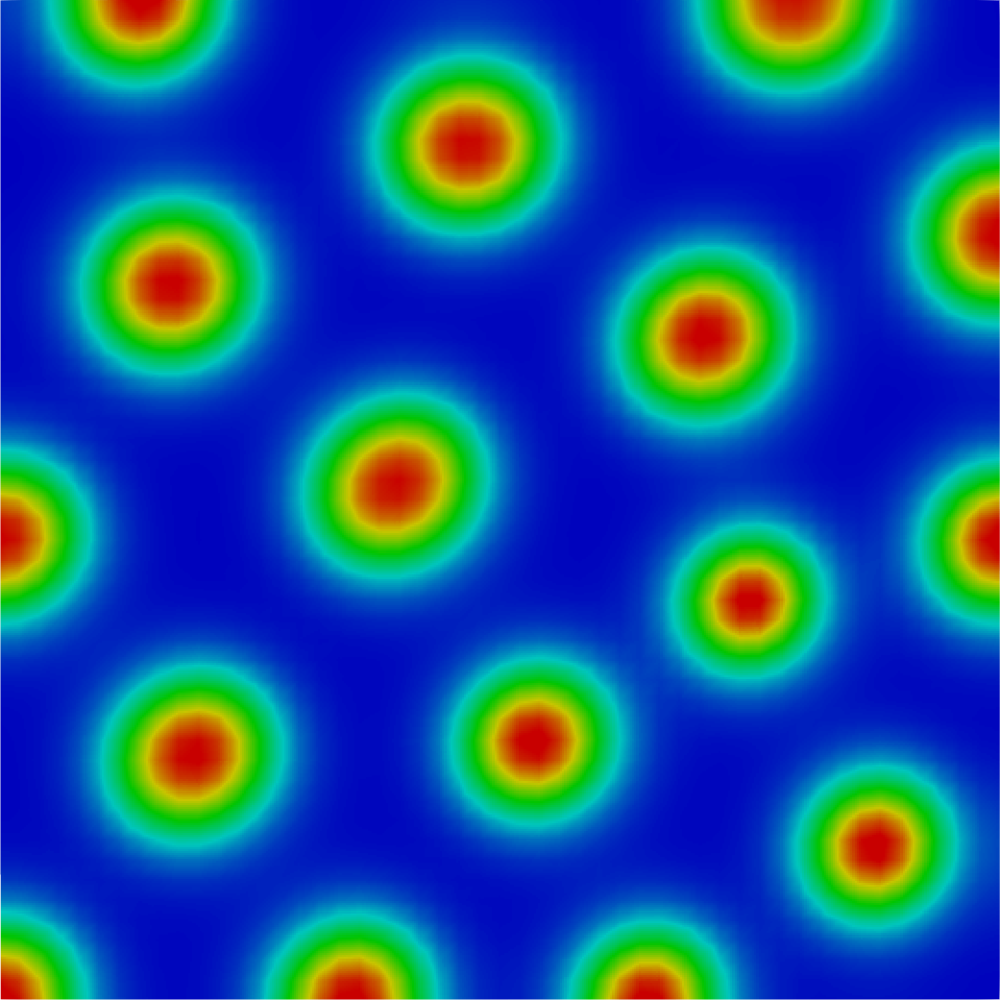

:orphan:

*********************
System identification
*********************

   Schematic of the Variational System Identification.
	 
Description
===========
Inference of PDEs from data–inverse modelling of not just parameters but of the entire set of algebraic and differential operators is feasible with the availability of extensive data, regression, and more generally, nonlinear optimization methods. Along with the development of neural network PDE solvers, system inference enjoys advantages when the variational setting of the weak form, as well as discretization structures such as finite elements and finite differences are exploited. The system identification workflow uses a class of inverse modeling techniques that allows physics discovery from data. 

Examples
========

Example 1: Pattern formation
----------------------------
The example used here is identifying the governing equation of Turing pattern physics:

 For an activator-inhibitor species pair, these equations use auto-inhibition with cross-activation of a short range species, and auto-activation with cross-inhibition of a long range species to form so-called Turing patterns:

   Example of the composition simulated using the Schnakenberg kinetics model.

Data preparation
^^^^^^^^^^^^^^^^
The data are generated by the coupled diffusion-reaction equations for two species following Schnakenberg kinetics. The Schnakenberg kinetics model was pre-built within this workflow, and can be called using the Schnakenberg_model interface (required FEniCS enabled):

.. literalinclude:: ../examples/systemID/Example1_pattern_forming/main.py 
   :lines: 20-21

The bases (operators) can be constucted afterward (required FEniCS enabled):
.. literalinclude:: ../examples/systemID/Example1_pattern_forming/main.py 
   :lines: 26-27

 Note the bases are also pre-calculated and save in the datasets, therefore in this example the data can be directly loaded from the data set. By defaults we constructed 14 operators with the following labeling:

 .. figure:: figures/systemID_operators
   :scale: 20 %
   :align: center

Configuration file
^^^^^^^^^^^^^^^^^^
Standard parameters in the workflow can be defined in the .ini configuration file. it usually contains two part: VSI and Stepwise regression. In VSI part, the identifying stragety and target operator index can be defined:

.. literalinclude:: ../examples/systemID/Example1_pattern_forming/config_Example1.ini
   :lines: 5-10

In Stepwise regression part, we can define the settings to perform stepwise regression. If some parameters are not defined, the default values will be applied.

.. literalinclude:: ../examples/systemID/Example1_pattern_forming/config_Example1.ini
   :lines: 12-19

How to run the example

The following commands will run the problem with the configuration file.

.. code-block:: bash

    cd examples/systemID/Example1_pattern_forming/
    python main.py config_Example1.ini

	 
Results

The final result is one array with non-zero prefactors for active operators and zero prefactors for non-active operators. Note by default we set the target operator to be the 

.. code-block:: bash
      Final result: [ 0.05  0.    0.1  -1.    0.    1.    0.    0.    0.    0.    0.    0.  0.  ]

References
==========

Z. Wang, X. Huan, K. Garikipati. "Variational system identification of the partial differential equations governing microstructure evolution in materials: Inference over sparse and spatially unrelated data", Computer Methods in Applied Mechanics and Engineering Vol 377, 113706, 2021, doi.org/10.1016/j.cma.2021.113706.
